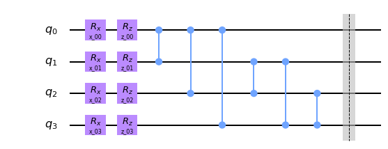

# README

The project is the execution of Task 1 of of the QOSF Mentorship Program 2020.
The task requirements can be found 
[here](https://docs.google.com/document/d/1Ow3v8Y4rYBdgxXNxKV9ZUAM4bwL6211U6DWCcByZ4A4/edit).  
In case the file is no longer available, I report it here (in brackets is my short rephrasing):
> Implement, on a quantum simulator of your choice, the following 4 qubits state |psi(theta)>:
>
>  
>
>Where the number of layers, denoted with L, has to be considered as a parameter. 
We call Layer [the circuit in the picture, so L=2 for example would mean the circuit in the picture repeated two times].
The angles, are variational parameters, lying in the interval (0, 2*pi ), initialized at random. 
Report with a plot, as a function of the number of layers, L, the minimum distance  
epsilon = min_theta(|| |\psi(\theta)> - |\phi> ||)  
Where |phi> is a randomly generated vector on 4 qubits and the norm [is Euclidean norm].  
Bonus question: 
Try using other gates for the parametrized gates and see what happens.

## Project structure
The project is composed by:
* **main.py**: The file to start optimization. The configuration for the runs is a dictionary in the file. 

* **results_summary.ipynb(.pdf)**: The notebook where results are presented and analyzed. Backup in pdf.

* **utilities**: Folder containing all the python support files:
    * **circuit_model.py**: Circuit class to work with the qiskit quantum circuit, independently from the optimizer.
    * **optimizer_base.py**: Base class for the optimizers.
    * **grad_optimizer.py**: Class for the gradient optimizer via Tensorflow Adam.
    * **scipy_optimizer.py**: Class for the scipy optimizer. Tested with *Nelder-Mead* but then deprecated in favour of 
                                Tensorflow.
    * **results.py**: Class to store and work with the optimization results.
    * **plot_helper.py**: Collection of methods to generate plots in the jupyter notebook.
    * **utils.py**: Collection of methods to support the operations during optimization. 
                
* **results**: Folder containing the optimization results in json format.

* **doc**: Folder containing extra material, like pictures for this README.

## Explore results
The results are collected in the jupyter notebook. To run it and make sure all plots are generated, 
it is necessary to perform the following steps:
1. Install requirements from `requirements.txt`;
2. Activate the Jupyter Widgets to inteact with the plots: `jupyter nbextension enable --py widgetsnbextension`.

In case of problem with jupyter, please refer to the pdf non interactive version.